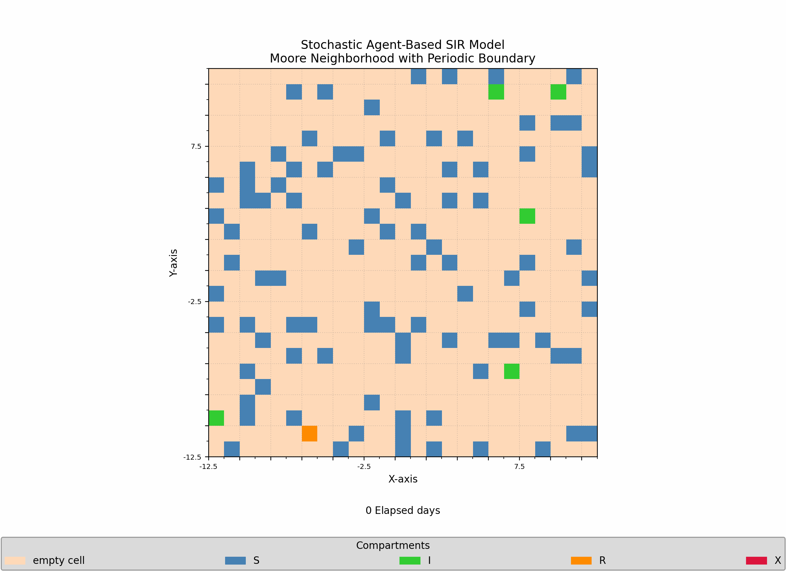

# Repo:    sir-model

The purpose of this project is to explore different SIR models.

## Description

The [SIR model is a compartmental model in epidimiology](https://en.wikipedia.org/wiki/Compartmental_models_(epidemiology)#The_SIR_model) that can be used to understand how a disease may spread. In this model, $S$ refers to the population that is susceptible to being infected, $I$ refers to the population that is infected, $R$ refers to the population that is removed (either due to death or immunity), and $N$ represents the total population across all compartments.  Given the infection rate $\beta$, the removal rate $\gamma$, and the initial populations $S_{t=0}$, $I_{t=0}$, $R_{t=0}$, the system of differential equations to be solved consists of three equations:

$\frac{dS}{dt} = -\frac{\beta}{N} I S$

$\frac{dI}{dt} = \frac{\beta}{N} I S - \gamma I$

$\frac{dR}{dt} = \gamma I$

where $N = S(t) + I(t) + R(t) \equiv$ constant

This model can be improved by accounting for birth rates and death rates, and other compartments (if appropriate). 

This code uses `scipy.integrate.solve_ivp` to solve this system of differential equations numerically. This code also contains methods to simulate stochastic transmission between random-walking agents on a 2-D rectangular lattice. An ensemble of these simulations can be used to identify various statistics of each compartment as a function of time.

Only synchronous transmissions (all agents updated per time-step) between neighboring agents are implemented as of now; at some point in the future, I plan to implement asynchronous transmissions as a function of distance between agents with waiting times according to a Poisson process.

## Getting Started

### Dependencies

* Python 3.9.6
* numpy == 1.26.4
* matplotlib == 3.9.4
* scipy == 1.13.1
* operator (default)

### Executing program

* Download this repository to your local computer
* Modify `path_to_save_directory` in the file-names that start with `example-` and then run them

## Version History

* 0.1
  * Initial Release

## License

This project is licensed under the Apache License - see the LICENSE file for details.
